## A-Site Lineups (T-Side)

### CT - [Smoke] - (Outside A-Main)

Jumpthrow

### CT - [Smoke] - (Mid)

[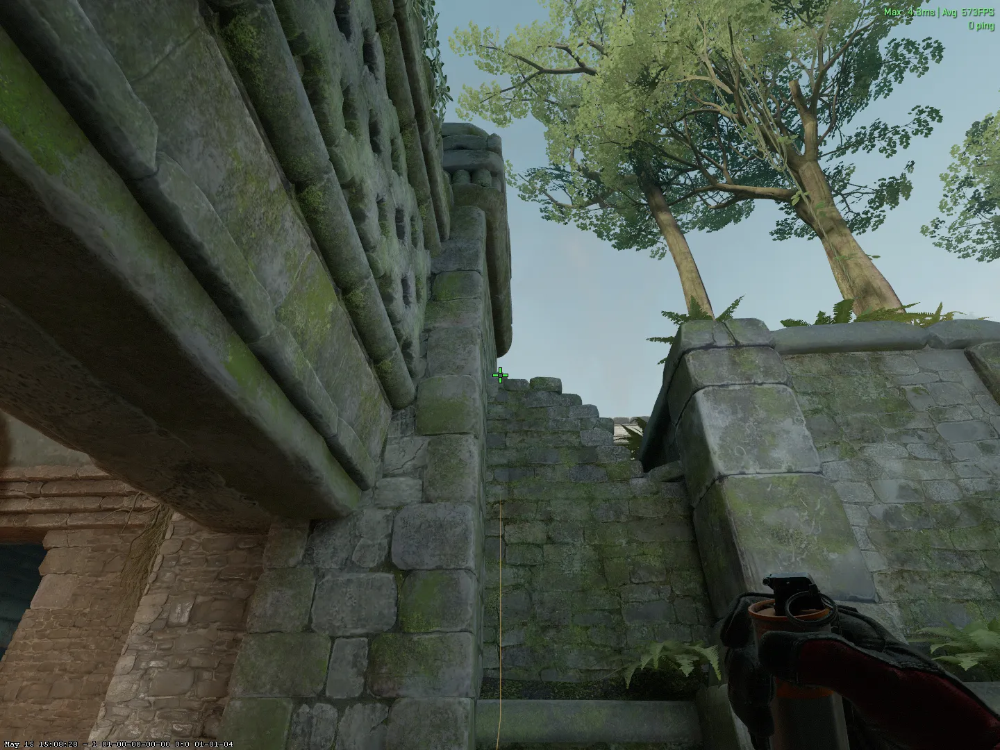](./images/ct_smoke_mid.webp)

### Donut - [Smoke] - (Outside A-Main)

Jumpthrow

## B-Site Lineups (T-Side)

### Deep Cave - [Smoke] - (T-Spawn)

Jumpthrow
[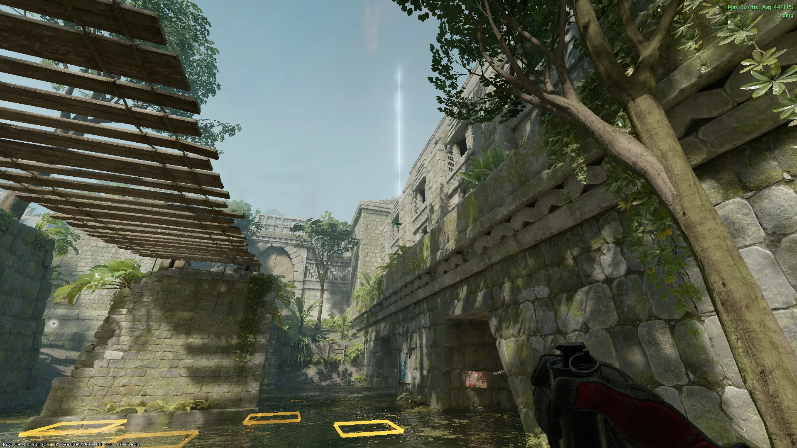](./images/deepcave_smoke_tspawn.webp)

### Cave Entrance - [Smoke] - (T-Spawn)

Jumpthrow

### Cave Entrance - [Smoke] - (Doors)

Jumpthrow
[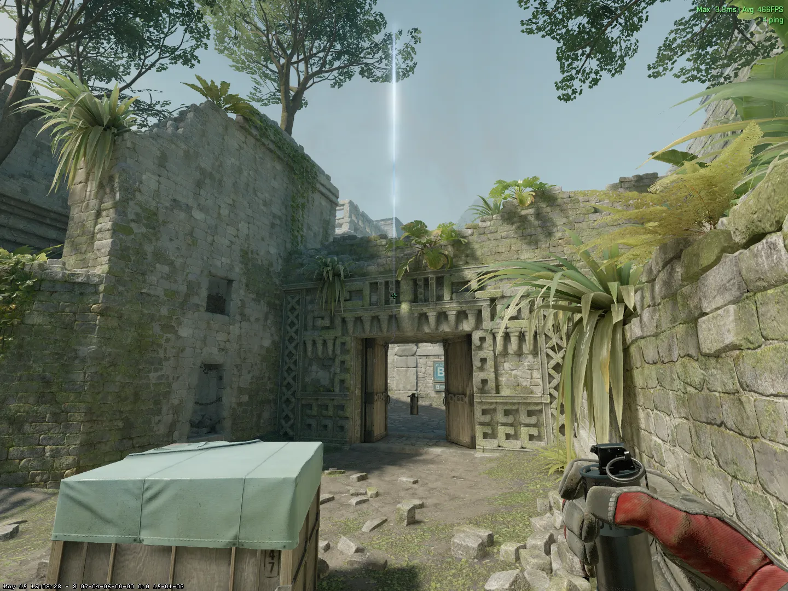](./images/cave_smoke_doors.webp)

### Site Lurk - [Smoke] - (T-Spawn)

+w Jumpthrow
[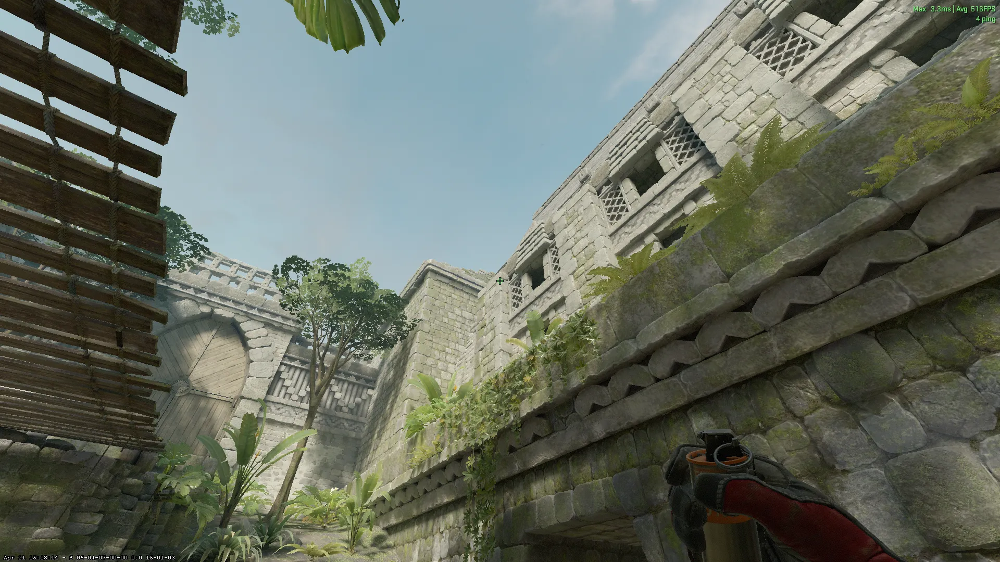](./images/bsite_smoke_tspawn.webp)

### Long - [Smoke] - (Doors)

### Long 2 - [Smoke] - (Doors)

Jumpthrow
[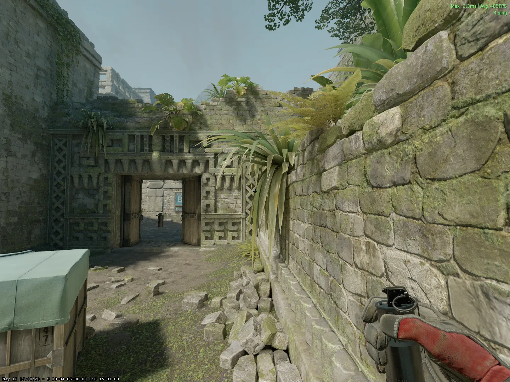](./images/long_smoke2_doors.webp)

### Short - [Smoke] - (Doors)

### Short 2 - [Smoke] - (Doors)

Jumpthrow
[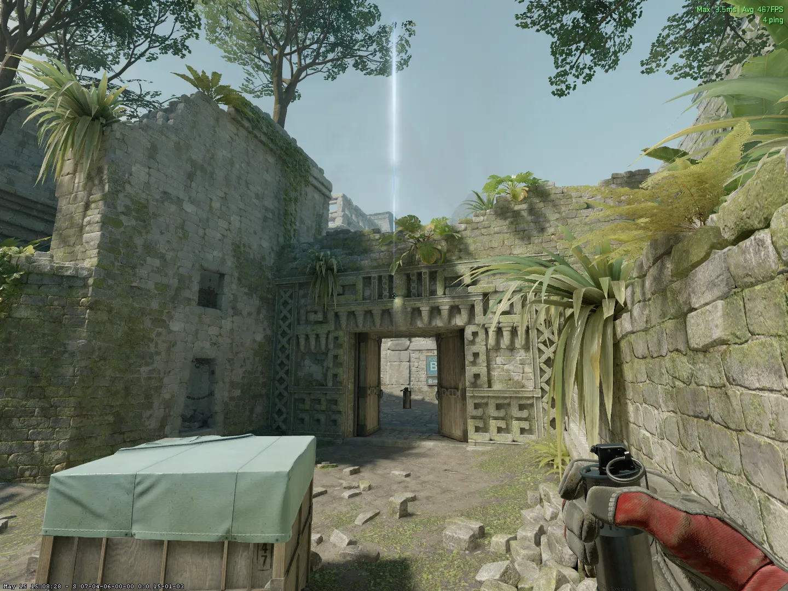](./images/short_smoke2_doors.webp)

### Deep CT - [Smoke] - (Doors)

Jumpthrow

### B-Site Corner [Molotov] - (Doors)

### B-Site [Molotov] - (Doors)

### Cave [Molotov] - (Doors)

Run Jumpthrow (L+R Click)
[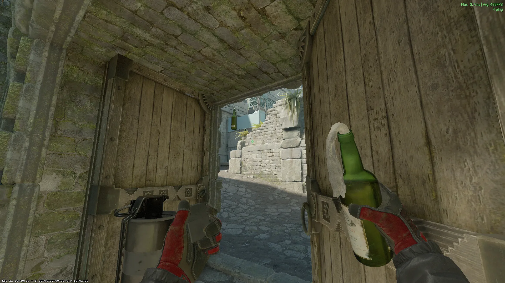](./images/cave_molly_doors.webp)

### B-Site [Flash] - (Outside Doors)

Jumpthrow

### B-Site 2 [Flash] - (Outside Doors)

Jumpthrow
[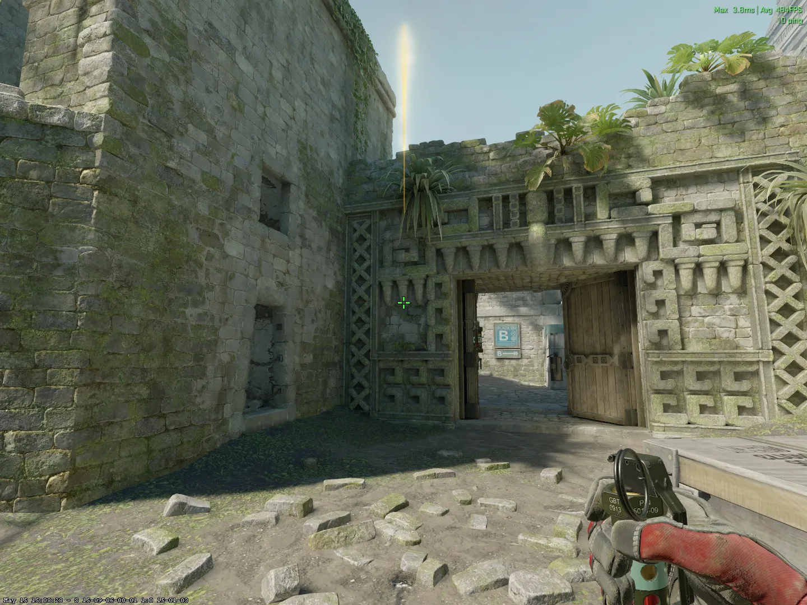](./images/bsite_flash2_doors.webp)

## B-Site Lineups (CT-Side)

### Doors - [Smoke] - (CT-Spawn)

Run Jumpthrow
[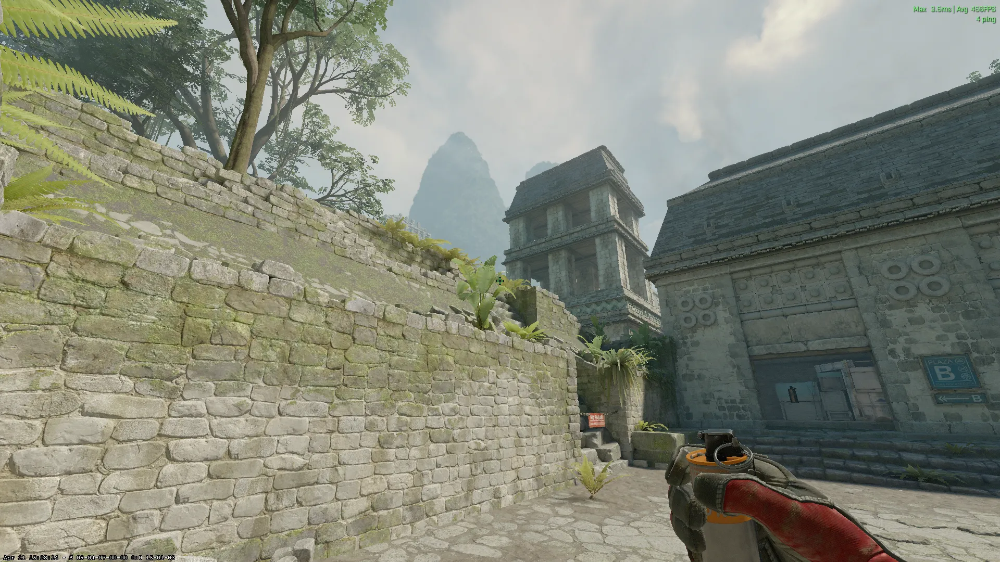](./images/door_smoke_ctspawn.webp)
[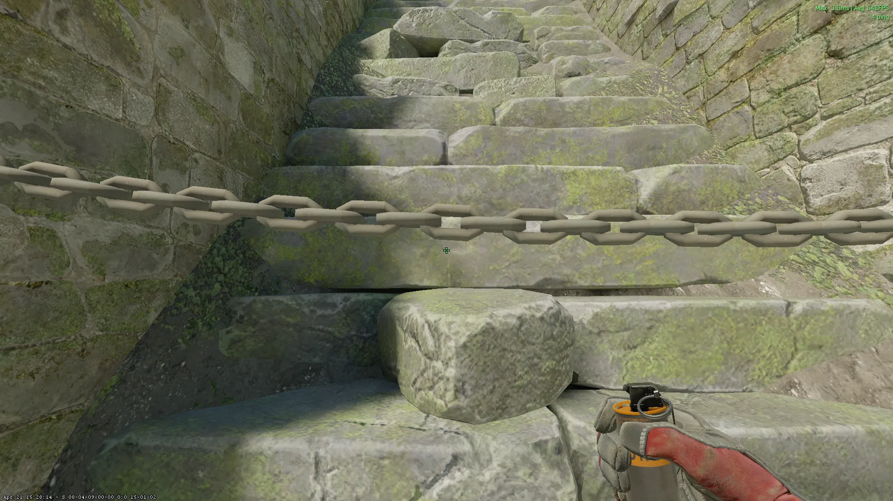](./images/door_smoke_ctspawn2.webp)

### Doors - [Smoke] - (Short)

Run Jumpthrow

### Doors - [Smoke] - (Long)

Jumpthrow
[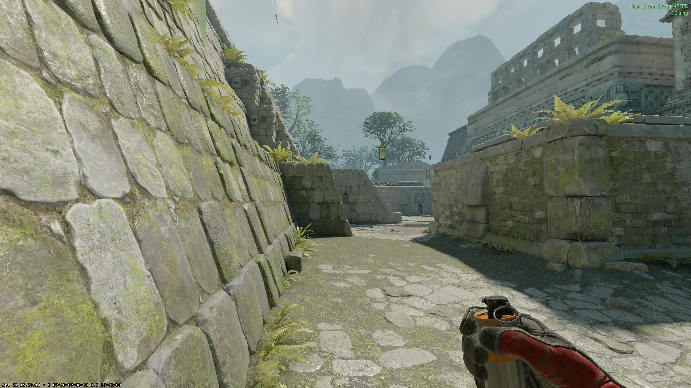](./images/door_smoke_long.webp)

### Lane - [Molotov] - (Short)

Run Jumpthrow (L+R Click)
[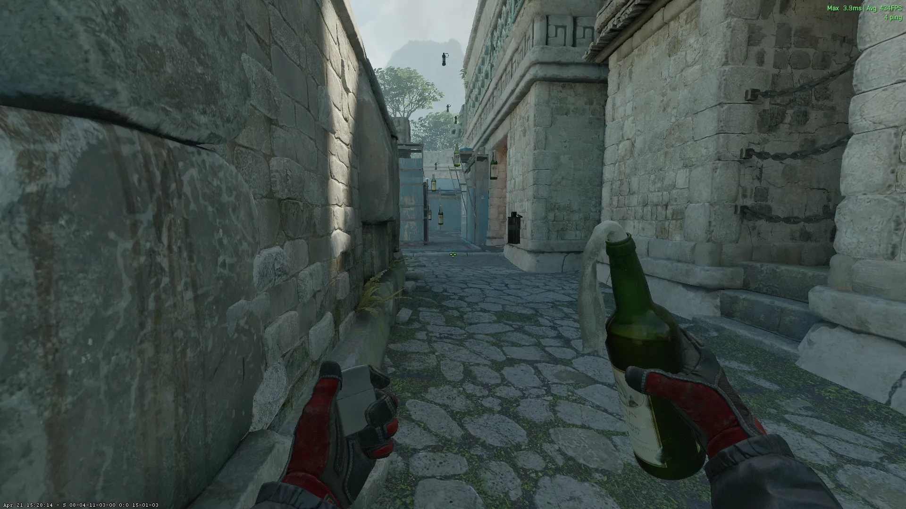](./images/lane_molly_short.webp)

### Lane - [Flash] - (Donut)

Jumpthrow
[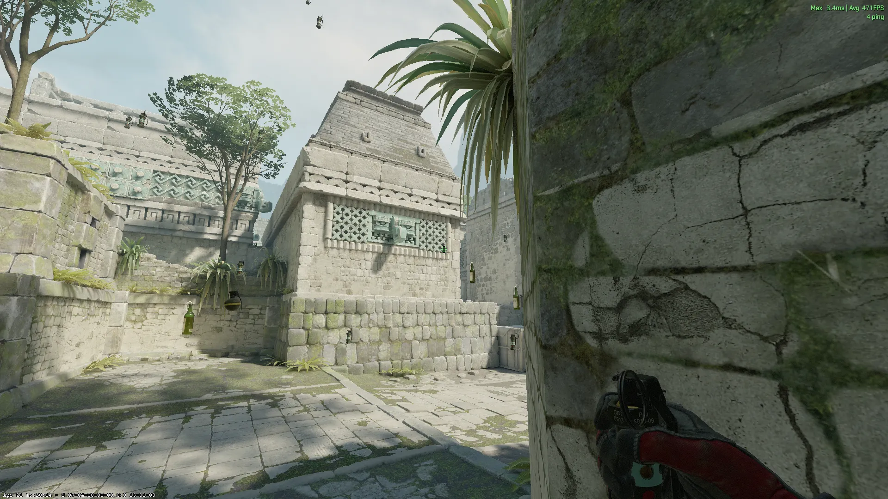](./images/lane_flash_donut.webp)

## Mid Lineups (T-Side)

### Redroom - [Smoke] - (T-Spawn)

Jumpthrow

### Redroom 2 - [Smoke] - (T-Spawn)

Jumpthrow
[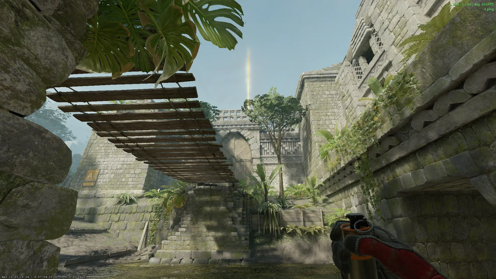](./images/redroom2_smoke_tspawn.webp)

### Heaven - [Smoke] - (T-Spawn)

Jumpthrow

### Mid - [Flash] - (T-Spawn)

+w Jumpthrow
[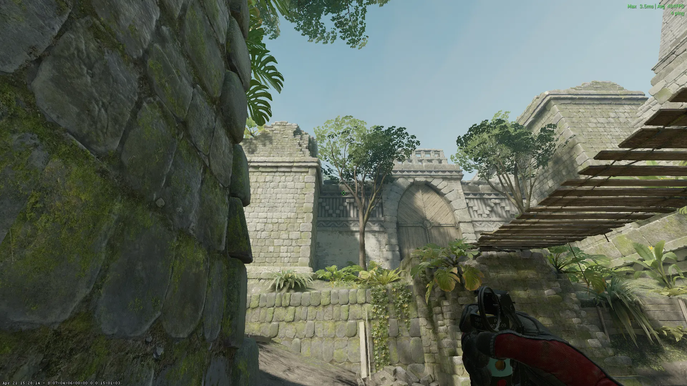](./images/mid_flash_tspawn.webp)

### Mid 2 - [Flash] - (T-Spawn)

+w Jumpthrow
[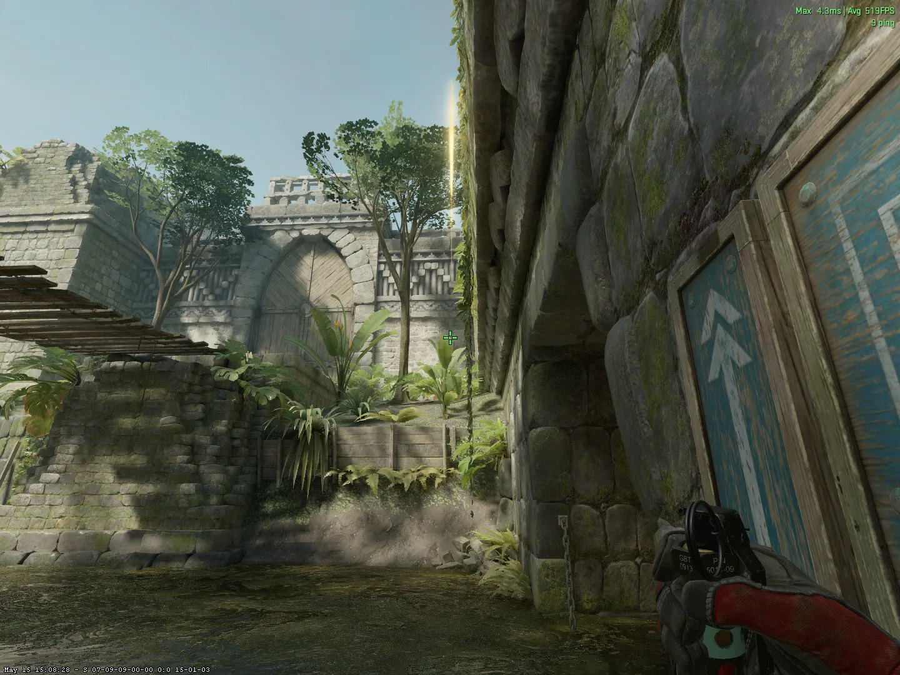](./images/mid_flash2_tspawn.webp)
