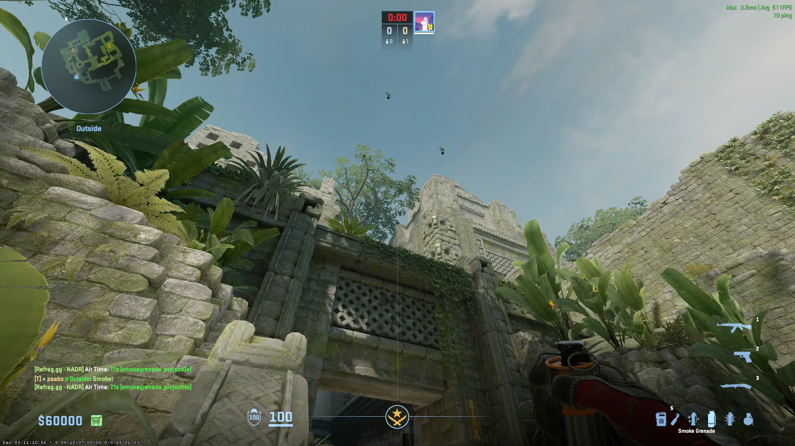
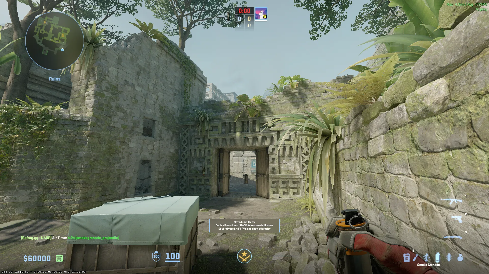
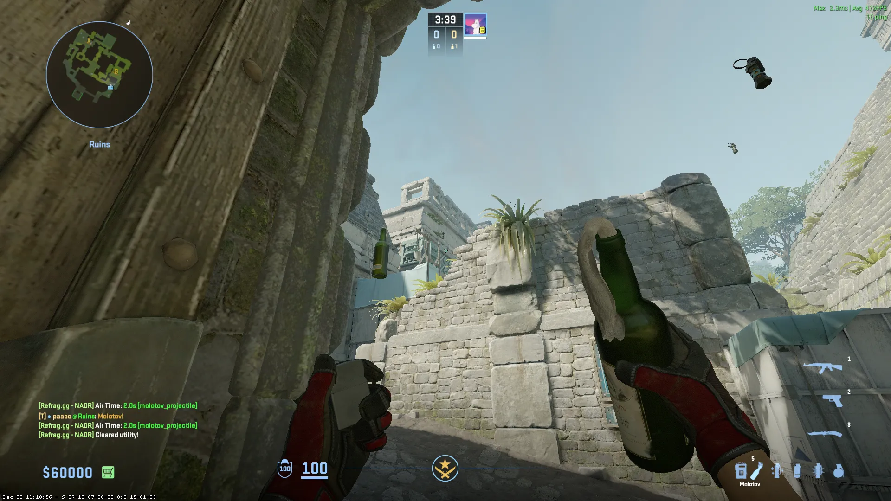

## A-Site Lineups (T-Side)

### CT - [Smoke] (Outside A-Main)

Jumpthrow

### Donut - [Smoke] - (Outside A-Main)

Jumpthrow

## B-Site Lineups (T-Side)

### Cave - [Smoke] - (T-Spawn)

Jumpthrow

### Long - [Smoke] - (Doors)

### Short - [Smoke] - (Doors)

### Deep CT - [Smoke] - (Doors)

Jumpthrow

### B-Site Corner [Molotov] - (Doors)

### B-Site [Molotov] - (Doors)

### B-Site [Flash] - (Outside Doors)

Jumpthrow

## B-Site Lineups (CT-Side)

### Ramp Door - [Smoke] - (From Short)

Run Jumpthrow

## Mid Lineups (T-Side)

### Redroom - [Smoke] - (T-Spawn)

Jumpthrow

### Heaven - [Smoke] - (T-Spawn)

Jumpthrow

