## A-Site Lineups (T-Side)

### A-Main - [Flash] - (Carpet)

Jumpthrow
[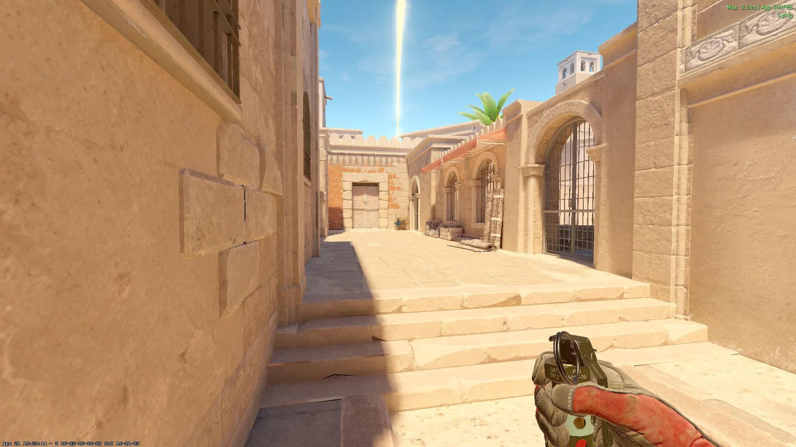](./images/amain_flash_carpet.webp)

### A-Site - [Flash] - (Water)

Jumpthrow
[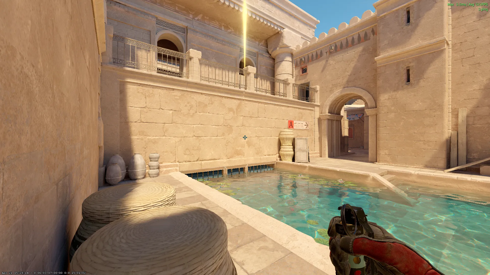](./images/asite_flash_water.webp)

### Camera - [Smoke] - (Boxes)

[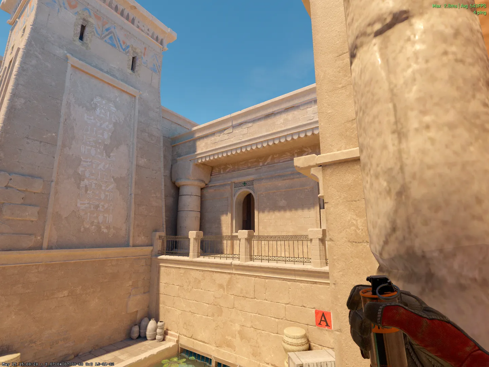](./images/camera_smoke_boxes.webp)

### Heaven - [Molotov] - (Boxes)

Run Jumpthrow
[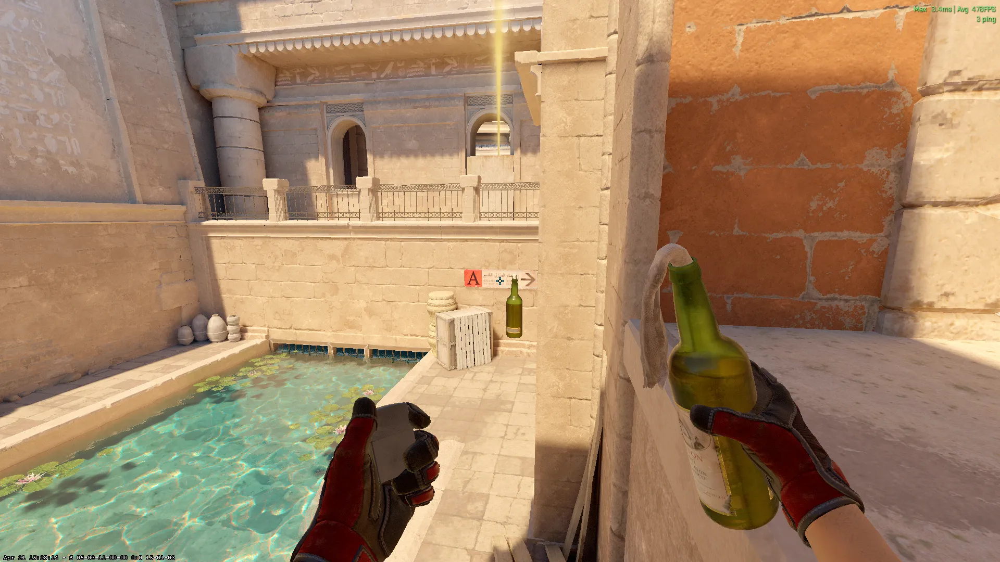](./images/heaven_mol_boxes.webp)

### HS/Wall - [Molotov] - (Boxes)

[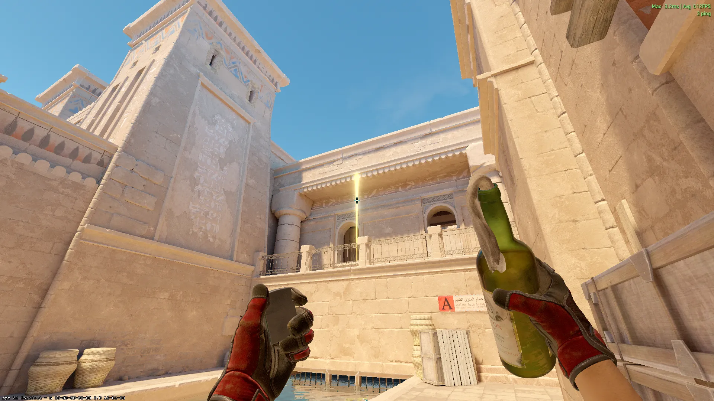](./images/hs_mol_boxes.webp)

## B-Site Lineups (T-Side)

### CT - [Smoke] - (T-Spawn)

Jumpthrow
[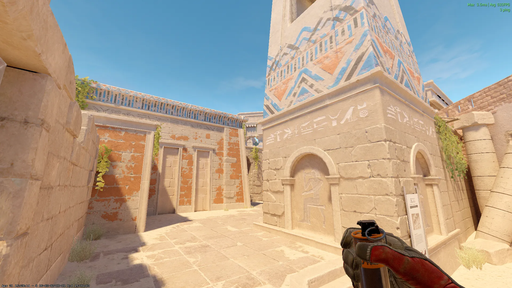](./images/ct_smoke_tspawn.webp)

### CT - [Smoke] - (B-Main)

Jumpthrow
[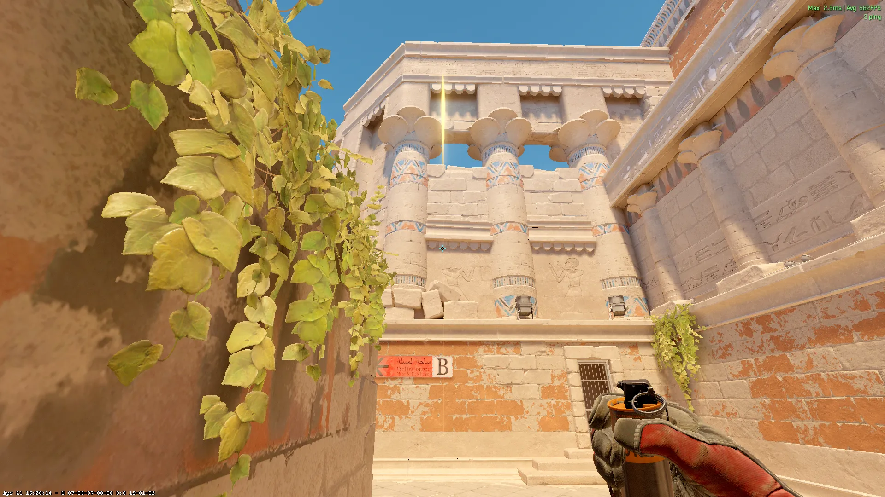](./images/bct_smoke_bmain.webp)

### B-Lurk - [Smoke] - (T-Spawn)

Jumpthrow
[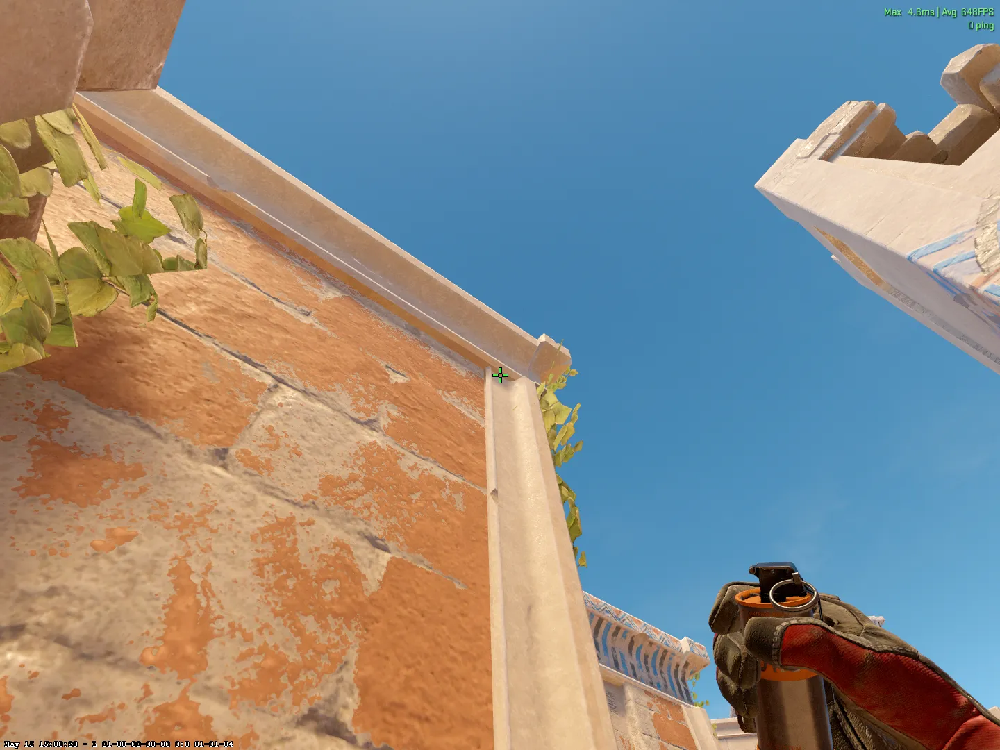](./images/blurk_smoke_tspawn.webp)

### B-Site - [Flash] - (B-Main)

Shift + Jumpthrow
[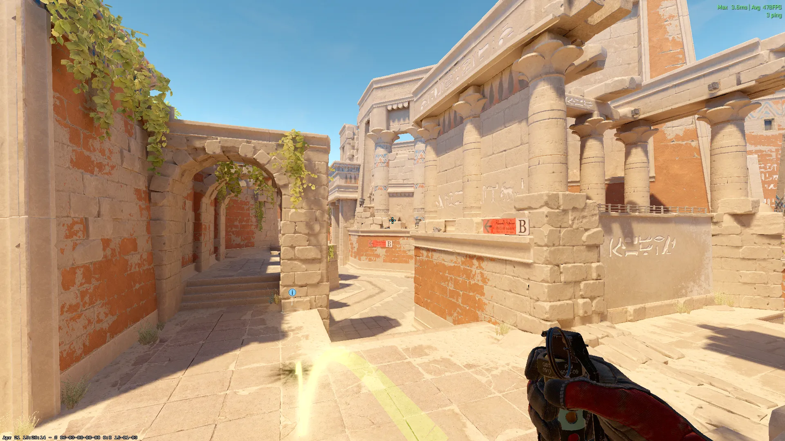](./images/bsite_flash_bmain.webp)

## B-Site Lineups (CT-Side)

### B-Main - [Flash] - (CT)

Jumpthrow
[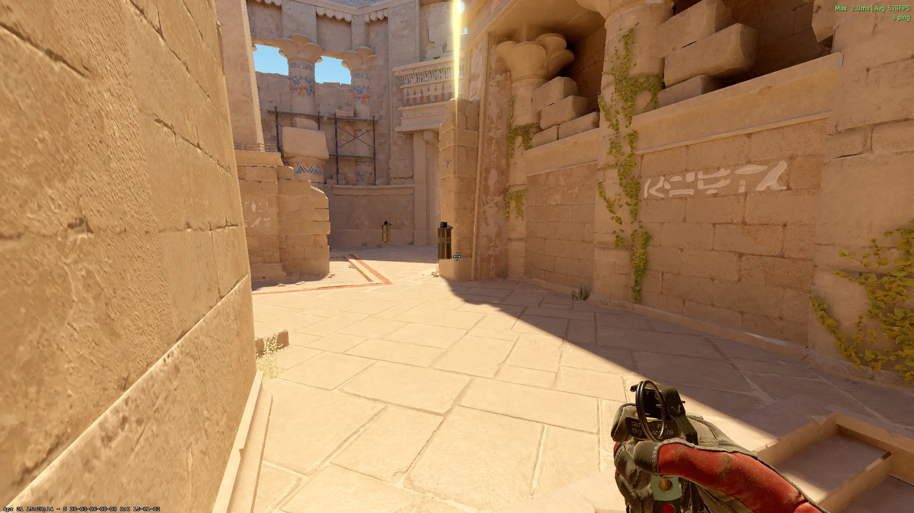](./images/bmain_flash_ct.webp)

## Mid Lineups (T-Side)

### Mid - [Smoke] - (T-Spawn)

Jumpthrow
[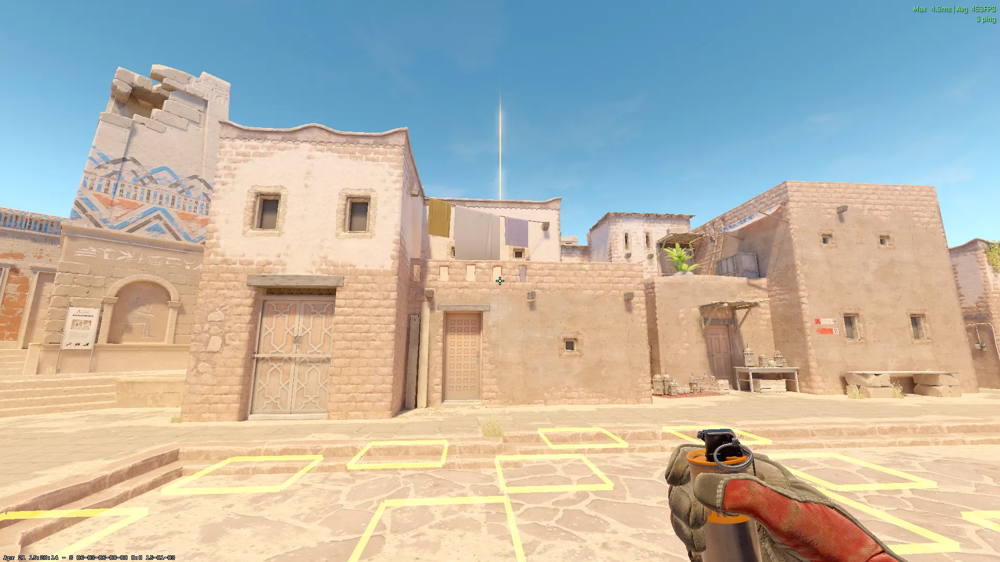](./images/mid_smoke_tspawn.webp)

### Temple - [Smoke] - (Outside Mid)

Jumpthrow
[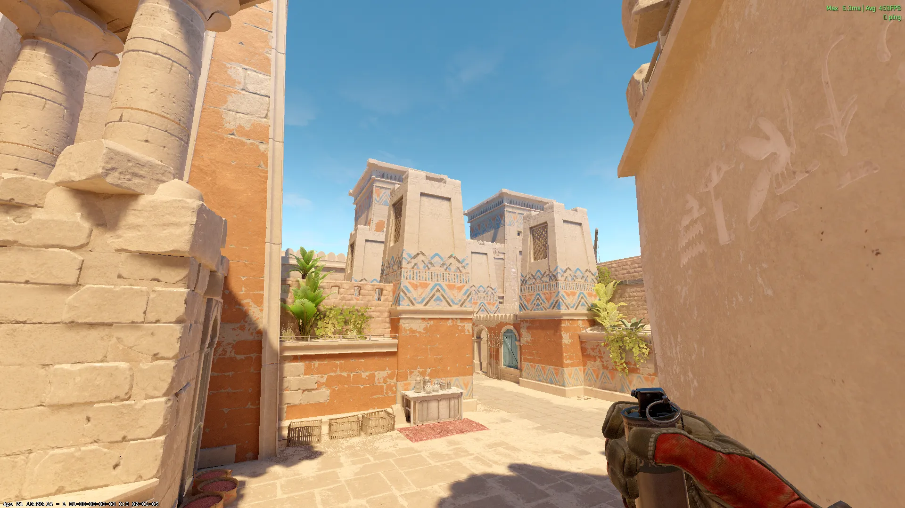](./images/temple_smoke_mid.webp)

### Temple 2 - [Smoke] - (Outside Carpets)

Jumpthrow
[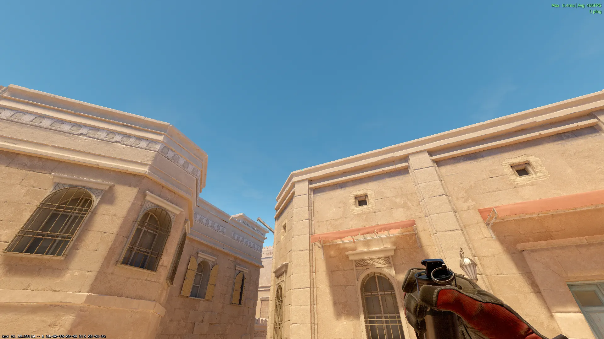](./images/temple_smoke_stairs.webp)

### Mid - [Flash] - (Outside Mid)

[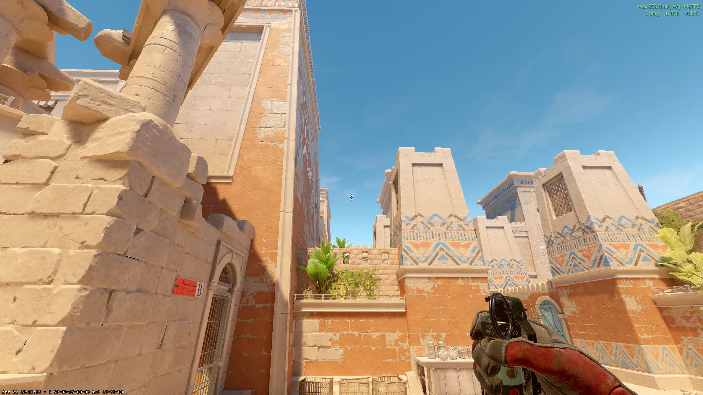](./images/mid_flash_mid.webp)

### Doors - [Molotov] - (Outside Mid)

Run + Jumpthrow
[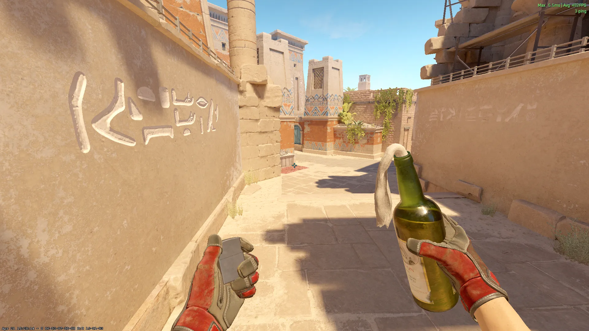](./images/mid_mol_mid.webp)
