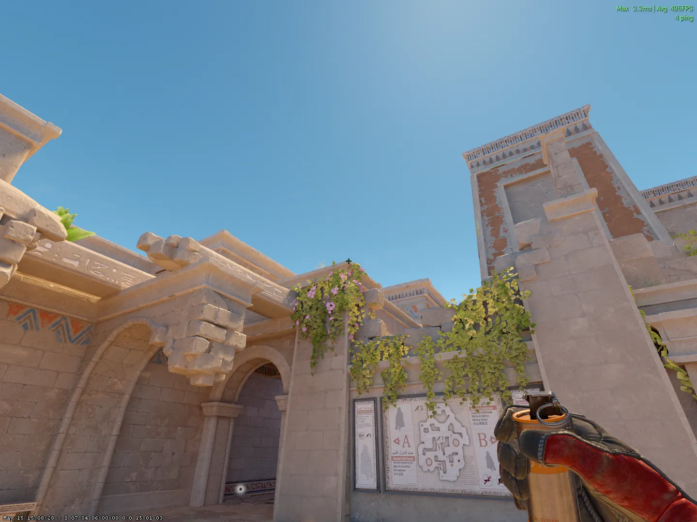
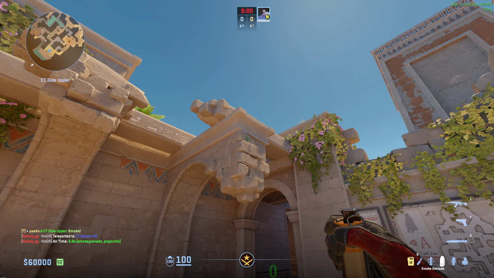
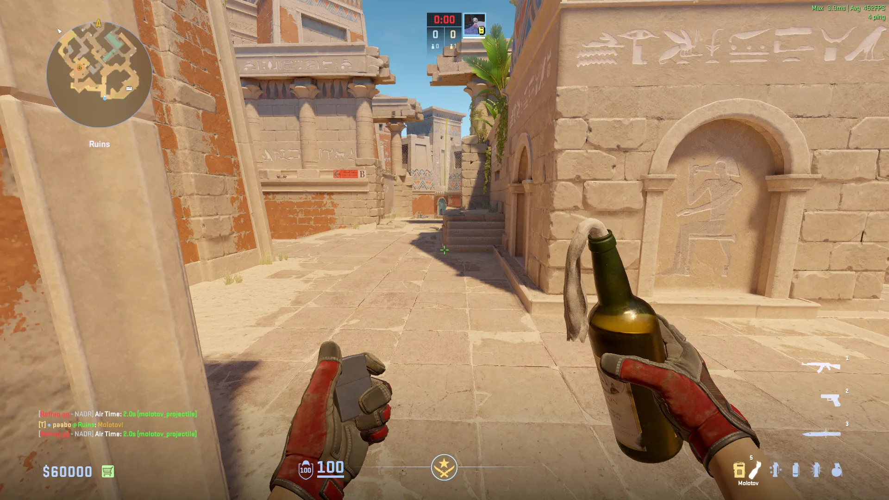
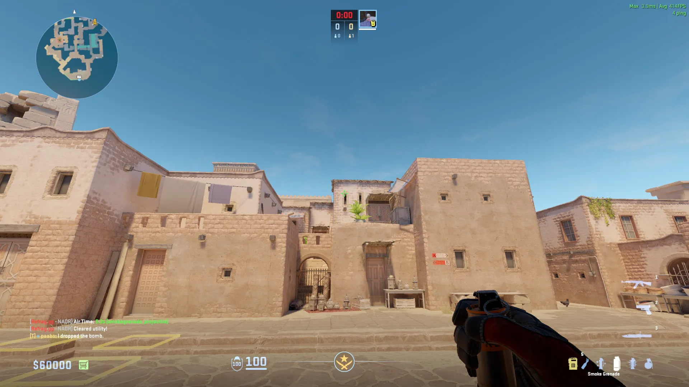
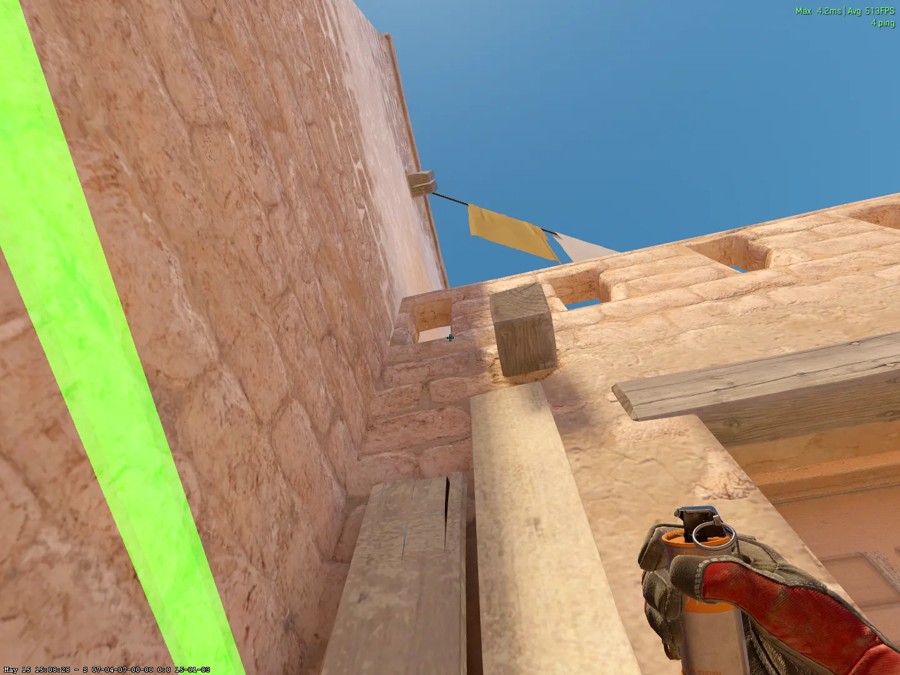
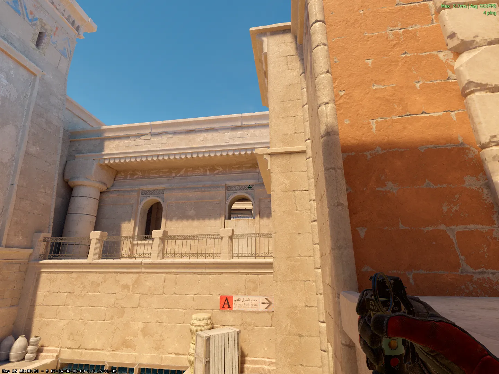
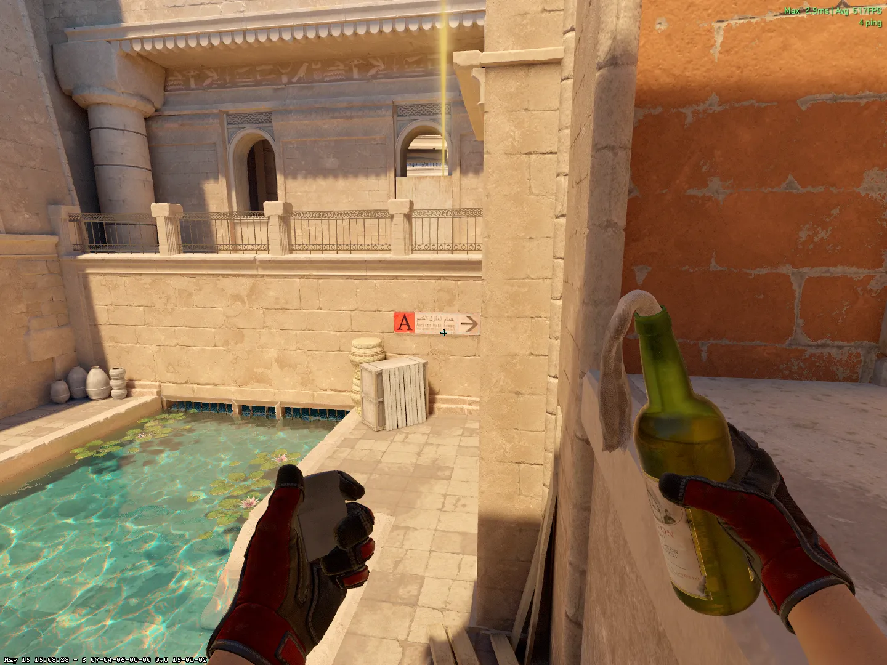
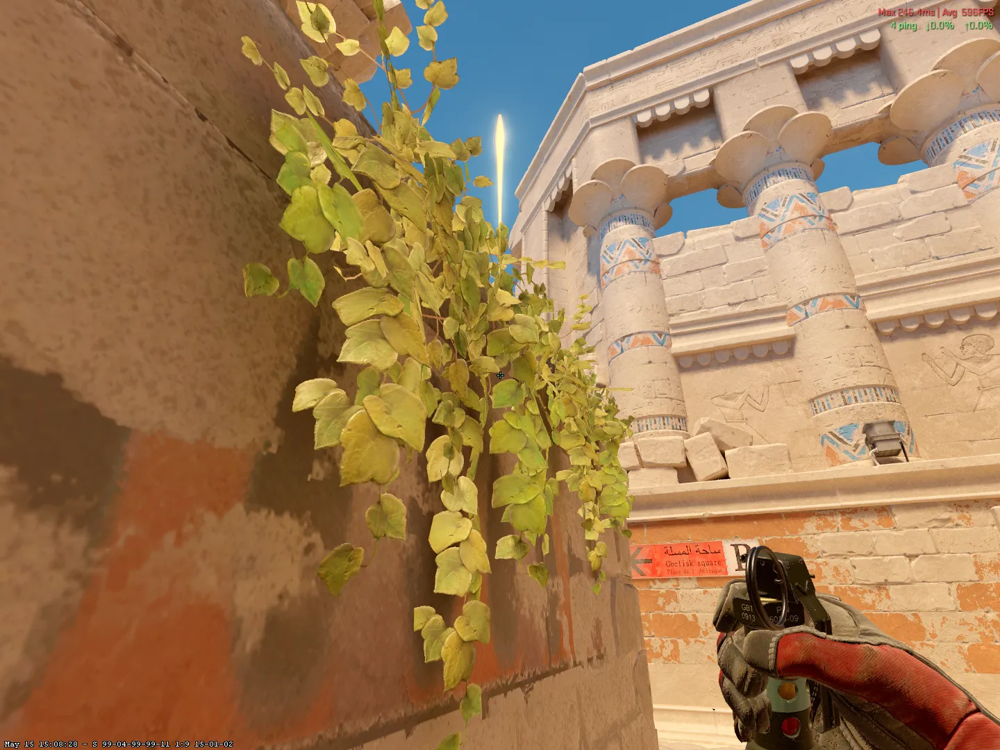
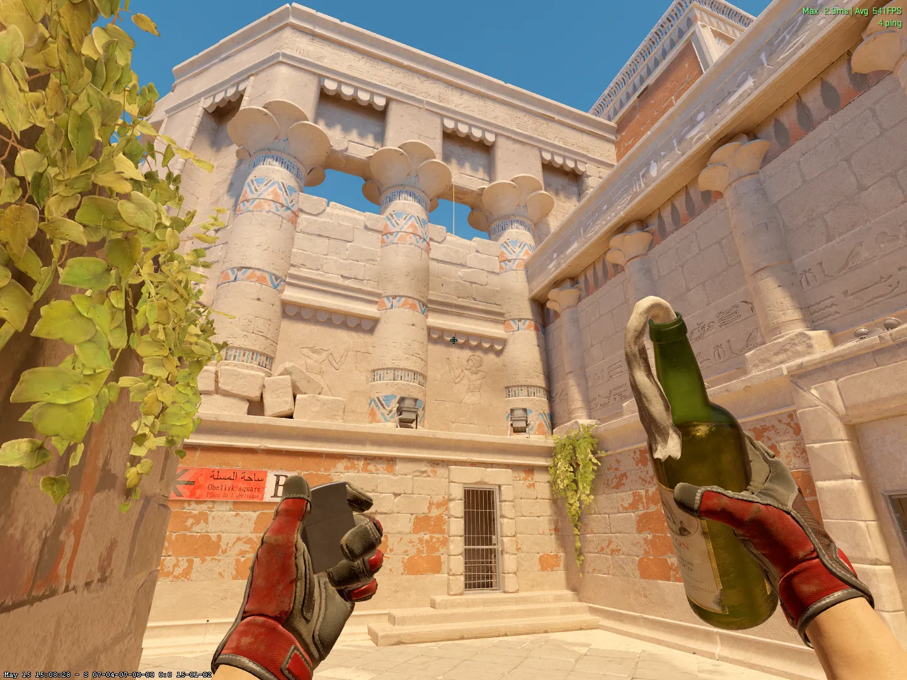

## Insta Lineups (CT-Side)

### Stairs - [Smoke] - (CT-Spawn)

Jumpthrow

### Insta Carpet - [Smoke] - (CT-Spawn)

+w Jumpthrow

## Mid Lineups (T-Side)

### Hole - [Molotov] - (T-Spawn)

Run + Jumpthrow (when crosshair hits 2nd bottom stair)

### Hole - [Smoke] - (T-Spawn)

+w Jumpthrow

### Mid - [Smoke] - (T-Spawn)

Jumpthrow

### Deep Connector - [Smoke] - (T-Spawn)

+W Jumpthrow

### Temple - [Smoke] - (Outside Mid)

Jumpthrow

### Temple 2 - [Smoke] - (Outside Carpets)

Jumpthrow

### Mid - [Flash] - (Outside Mid)

### Doors - [Molotov] - (Outside Mid)

Run + Jumpthrow

## A-Site Lineups (T-Side)

### A-Main - [Flash] - (Carpet)

Jumpthrow

### A-Site - [Flash] - (Water)

Jumpthrow

### A-Site 2 - [Flash] - (Boxes)

Crouch

### Camera - [Smoke] - (Boxes)

### A-Site / Cake - [Molotov] - (Boxes)

+W Jumpthrow

### Heaven - [Molotov] - (Boxes)

Run Jumpthrow

### HS/Wall - [Molotov] - (Boxes)

## B-Site Lineups (T-Side)

### CT - [Smoke] - (T-Spawn)

Jumpthrow

### CT - [Smoke] - (B-Main)

Jumpthrow

### B-Lurk - [Smoke] - (T-Spawn)

Jumpthrow

### B-Site - [Flash] - (B-Main)

Shift + Jumpthrow

### B-Site 2 - [Flash] - (B-Main)

Jumpthrow

### Pilar - [Molotov] - (B-Main)

Jumpthrow

## B-Site Lineups (CT-Side)

### B-Main - [Flash] - (CT)

Jumpthrow

