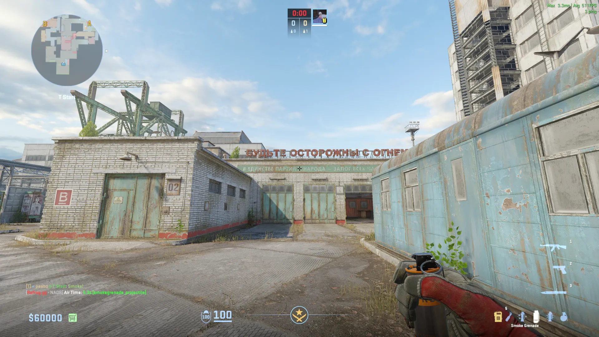
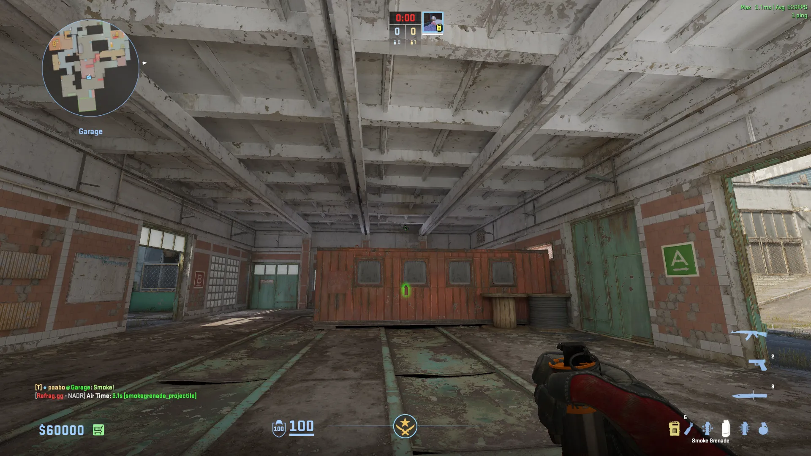
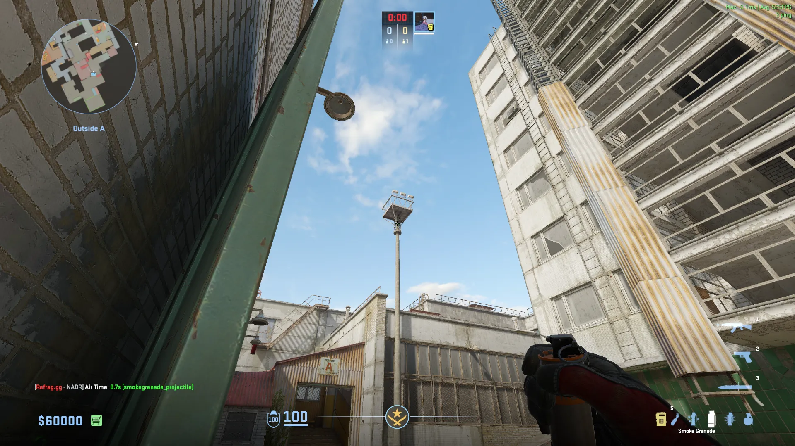
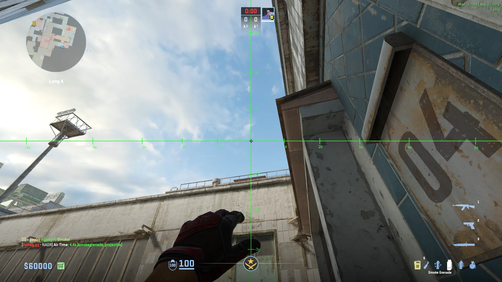
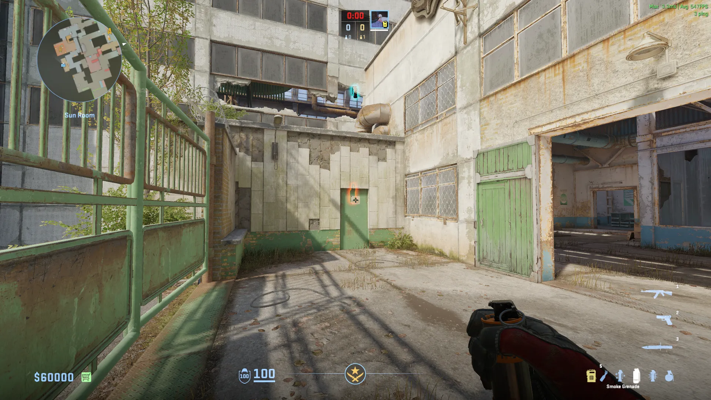
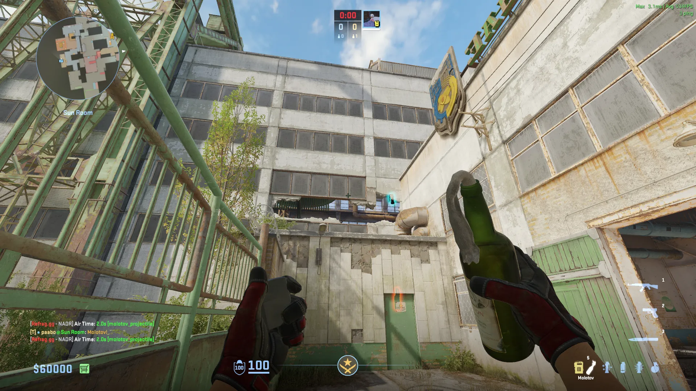

## Mid Lineups (T-Side)

### Connector - [Smoke] - (T-Spawn)

### Criss-Cross Right - [Smoke] - (Garage)

### Criss-Cross Left - [Smoke] - (Garage)

## A-Site Lineups (T-Side)

### Backsite - [Smoke] - (Outside Spawn)

### Cross Waterfall - [Smoke] - (Outside Door)

## B-Site Lineups (T-Side)

### CT - [Smoke] - (Sun Room)

Middle click +w Jumpthrow

### HS - [Molotov] - (Sun Room)

