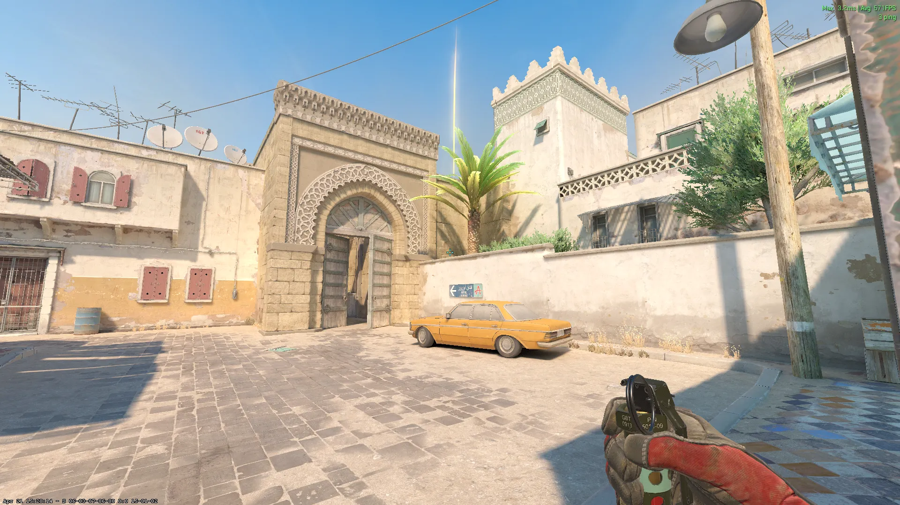
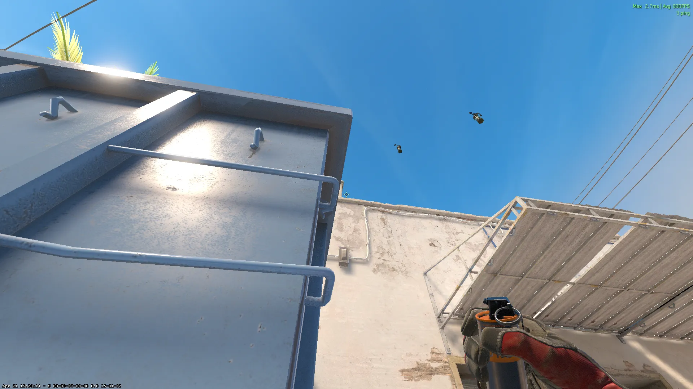
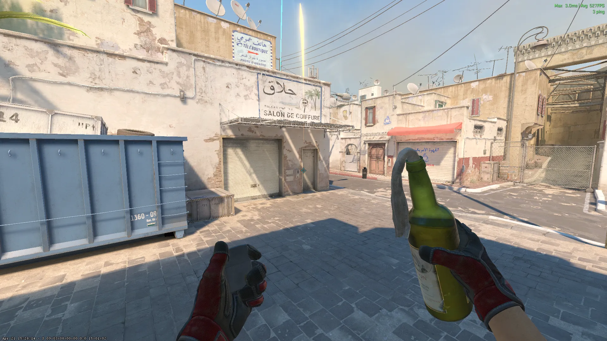
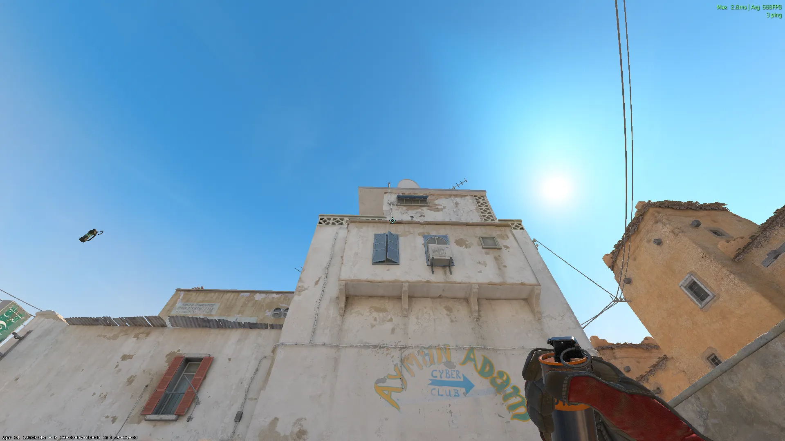
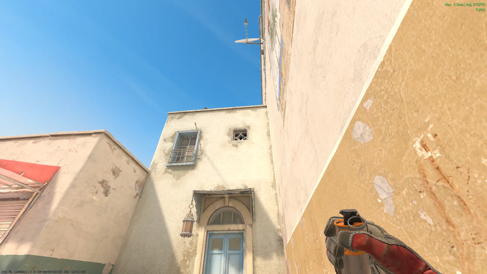
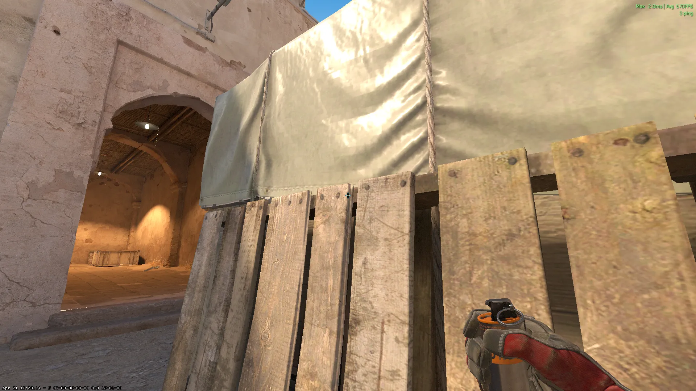
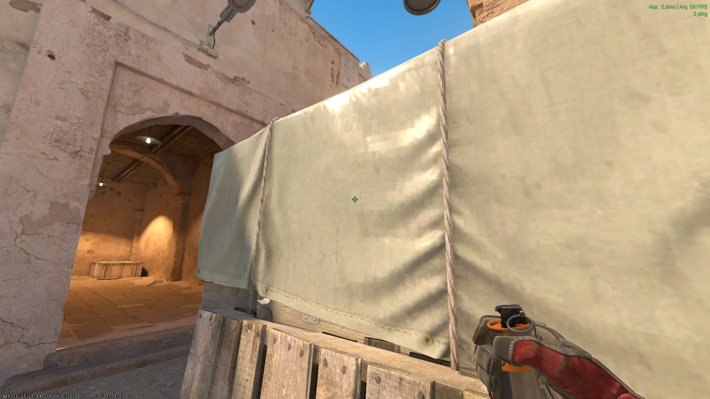
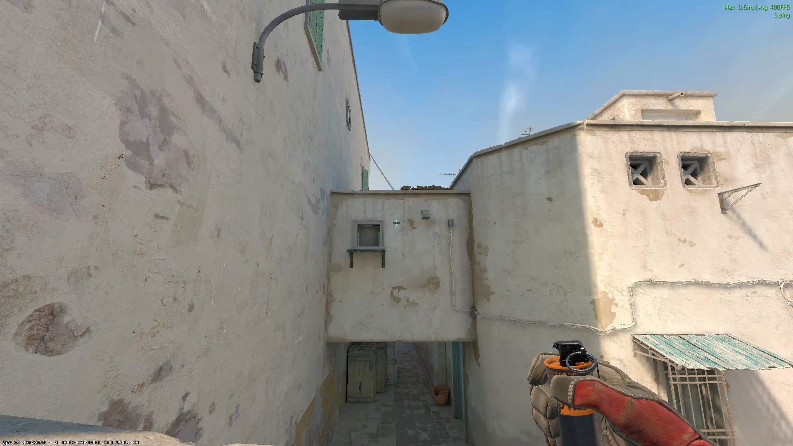
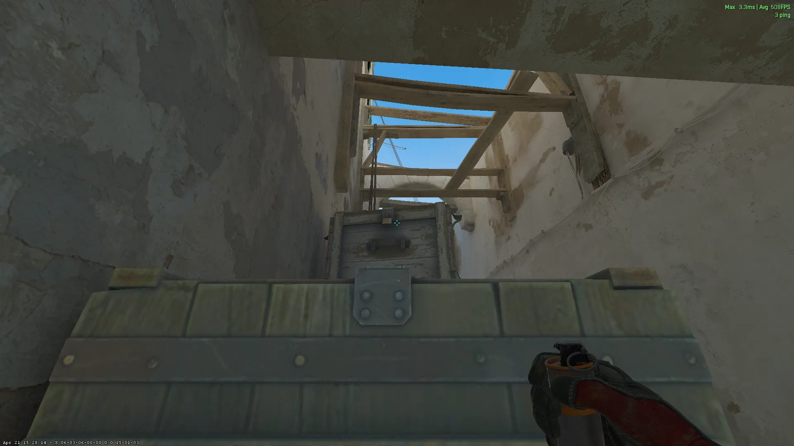

## A-Site Lineups (T-Side)

### Long - [Flash] - (T-Spawn)

Jumpthrow

### Cross - [Smoke] - (Long)

### Car - [Molotov] - (Long)

+W Jumpthrow

## A-Site Lineups (CT-Side)

### Long Box - [Smoke] - (CT-Spawn)

Jumpthrow

## B-Site Lineups (T-Side)

### B-Doors - [Smoke] - (T-Spawn)

+W Jumpthrow

### CT-Cross - [Smoke] - (Xbox)

Crouch aim -> Stand up Jumpthrow

## Mid Lineups (T-Side)

### Doors Smoke - [Smoke] - (T-Spawn)

Jumpthrow

### Doors Smoke 2 - [Smoke] - (Suicide)

Jumpthrow

