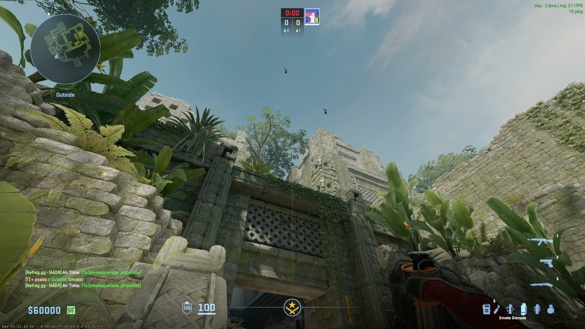
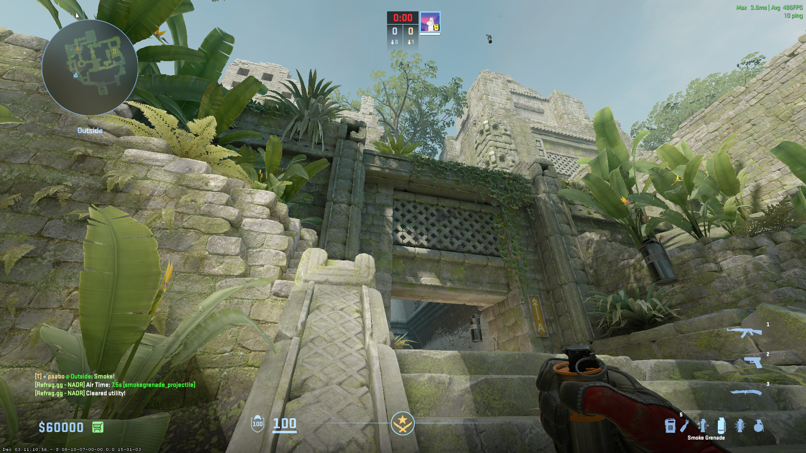
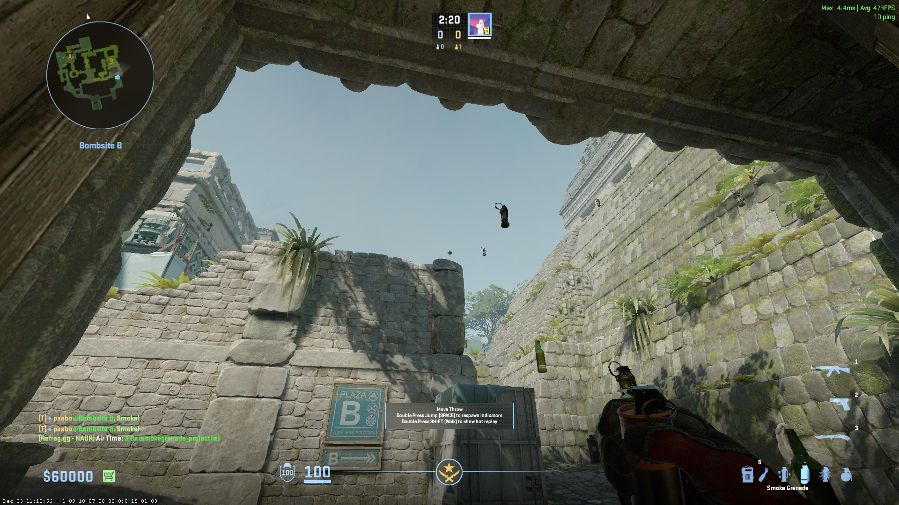
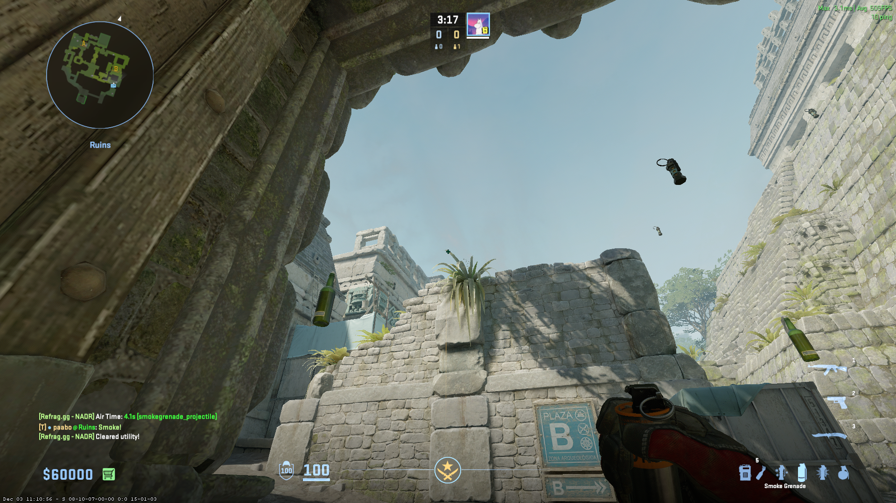
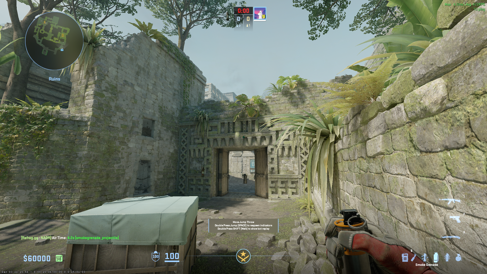
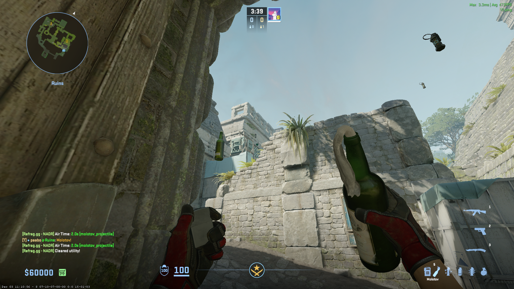
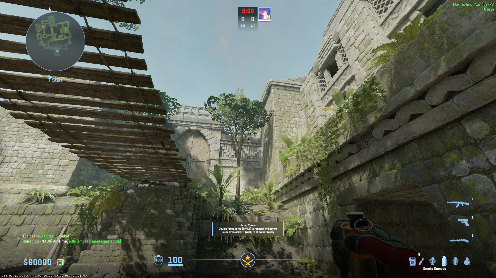

# A-Site Lineups

## Terrorists (T)

### CT - [Smoke] (Outside A-Main)
* Jumpthrow

### Donut - [Smoke] - (Outside A-Main)
* Jumpthrow

# B-Site Lineups

## Terrorists (T)

### Cave - [Smoke] - (T-Spawn)
* Jumpthrow

### Long - [Smoke] - (Doors)

### Short - [Smoke] - (Doors)

### Deep CT - [Smoke] - (Doors)
* Jumpthrow

### B-Site Corner [Molotov] - (Doors)

### B-Site [Molotov] - (Doors)

### B-Site [Flash] - (Outside Doors)
* Jumpthrow

## Counter-Terrorist (CT)

### Ramp Door - [Smoke] - (From Short)
* Run Jumpthrow

# Mid Lineups

## Terrorist (T)

### Redroom - [Smoke] - (T-Spawn)
* Jumpthrow

### Heaven - [Smoke] - (T-Spawn)
* Jumpthrow

