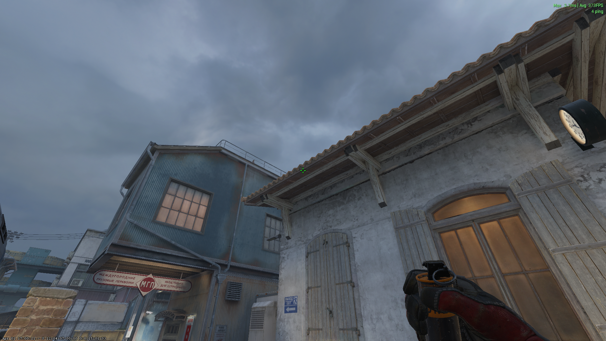
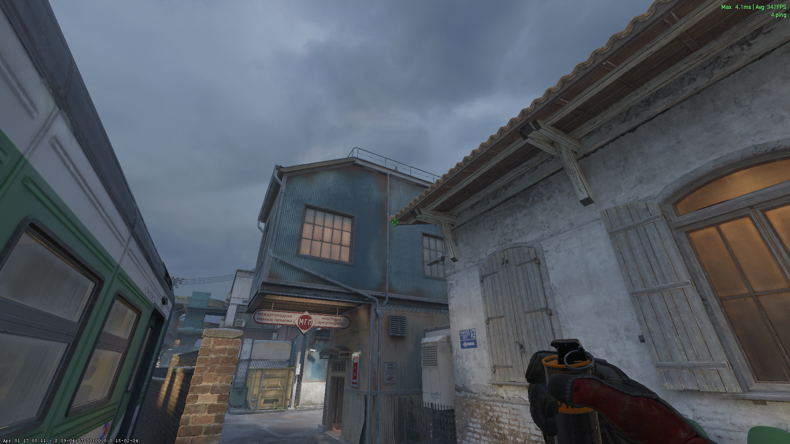

# A-Site Utility
## Terrorist (T)

### A-Site - [Flash] - (T-Spawn)
Jumpthrow

### A-Site 2 - [Flash] - (T-Spawn)
Jumpthrow

### Connector - [Smoke] - (T-Spawn)
Jumpthrow

### Camera / Ivy - [Smoke] - (T-Spawn)

### Sandwich - [Smoke] - (T-Spawn)

# B-Site Utility
## Terrorist (T)

### Connector [Smoke] (B-Halls)

## Counter-Terrorist (CT)

### B-Halls [Flash] - (B-Halls)

