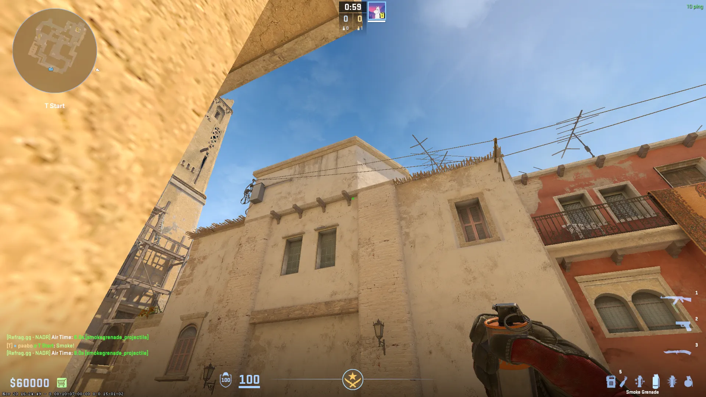
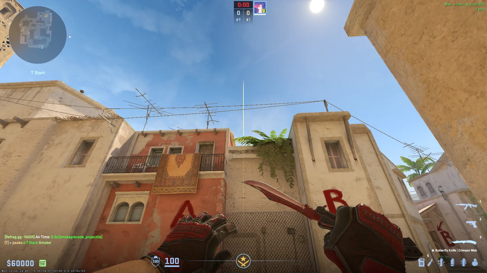
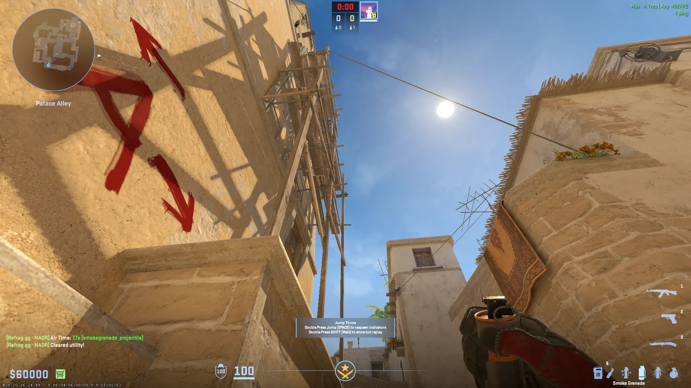

## Instant Window Smokes

### Spawn 1

+w Jumpthrow

### Spawn 2

+w Jumpthrow

### Spawn 3

+w Jumpthrow

### Spawn 4

+w Jumpthrow

### Spawn 5

+w Jumpthrow

## Mid Lineups (T-Side)

### Top connector - [Smoke] - (T-Spawn)

+w Jumpthrow

### Short 1 - [Smoke] - (T-Spawn)

Jumpthrow

### Short 2 - [Smoke] - (T-Spawn)

Jumpthrow

## A-Site Lineups (T-Side)

### Jungle - [Smoke] - (Ramp)

Jumpthrow

### Jungle 2 - [Smoke] - (Ramp)

### Stairs - [Smoke] - (Ramp)

Jumpthrow

### Stairs 2 - [Smoke] - (Ramp)

Jumpthrow (L+R Click)

### CT - [Smoke] - (Ramp)

Jumpthrow

### Top Connector - [Smoke] - (Ramp)

Jumpthrow

### Deep Jungle - [Smoke] - (Ramp)

Jumpthrow

### Jungle - [Smoke] - (T-Spawn)

Jumpthrow

### Stairs - [Smoke] - (T-Spawn)

Jumpthrow

