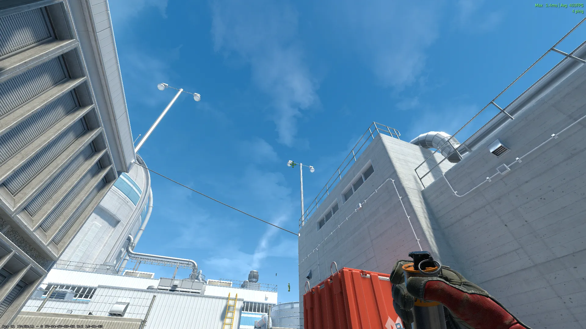
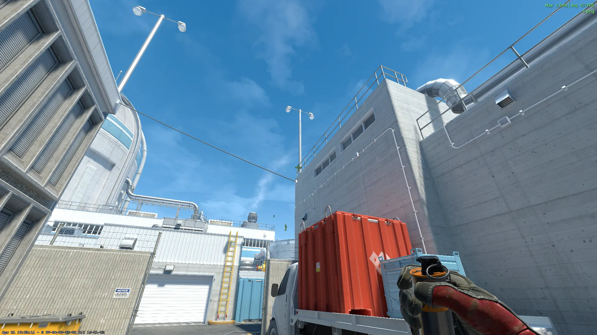
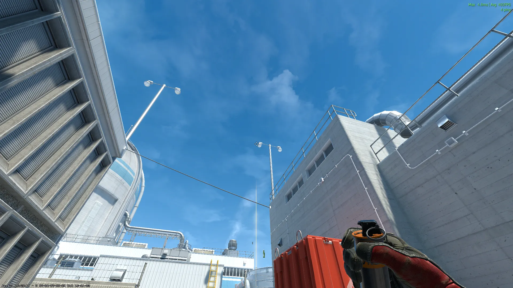
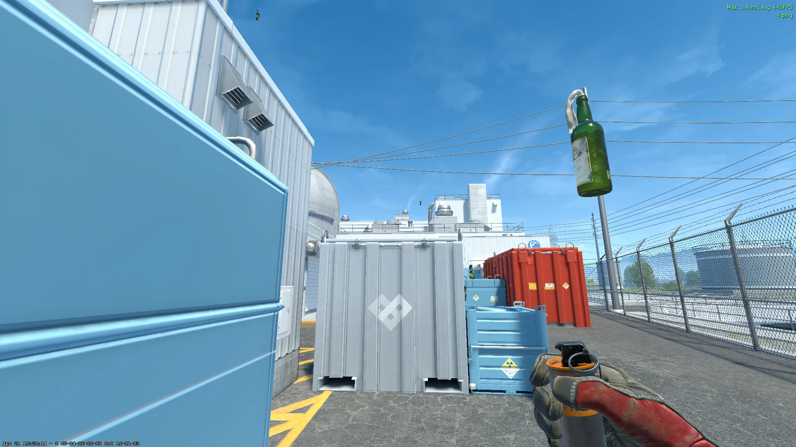
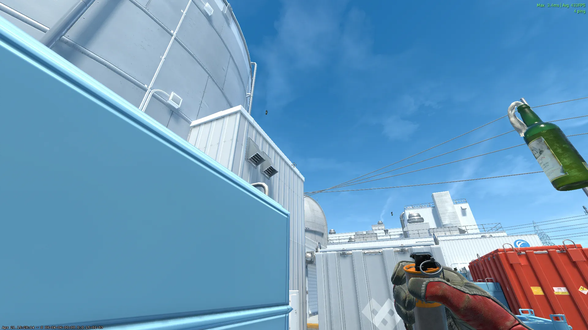
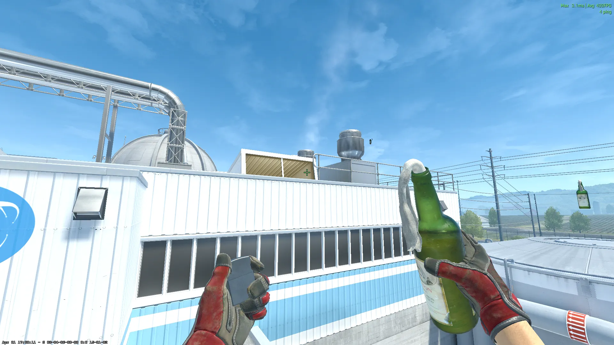
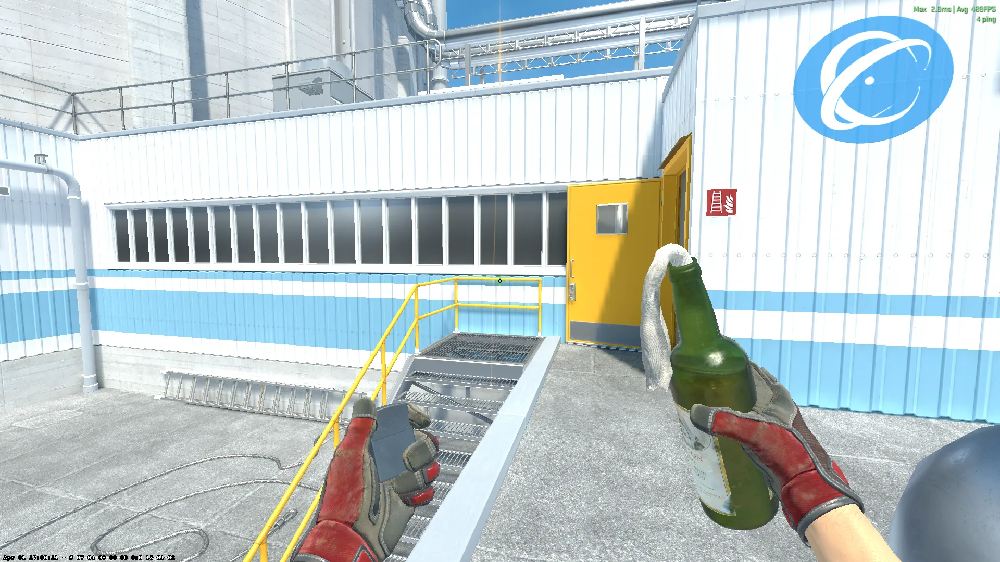
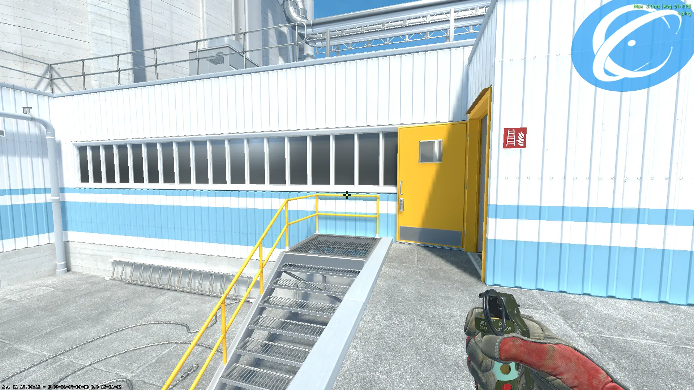

## Outside Lineups - (T-Side)

### Outside 1 - [Smoke] - (T-Spawn)

Jumpthrow

### Outside 2 - [Smoke] - (T-Spawn)

Jumpthrow

### Main - [Smoke] - (T-Spawn)

Jumpthrow

### Garage - [Smoke] - (T-Blue)

### CT-Blue - [Smoke] - (T-Blue)

## A-Site Lineups (T-Side)

### Hut - [Molotov] - (Roof)

### A-Site - [Molotov] - (Roof)

Jumpthrow

### A-Site - [Flash] - (Roof)

Jumpthrow

