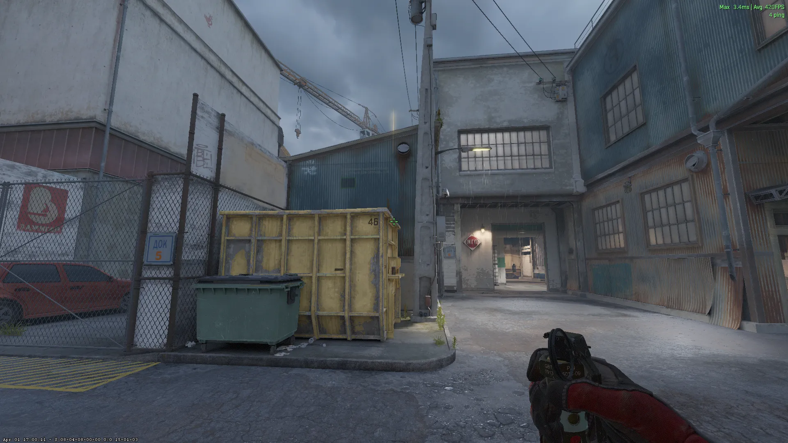
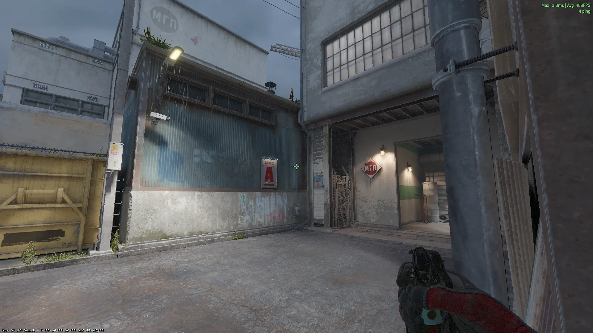
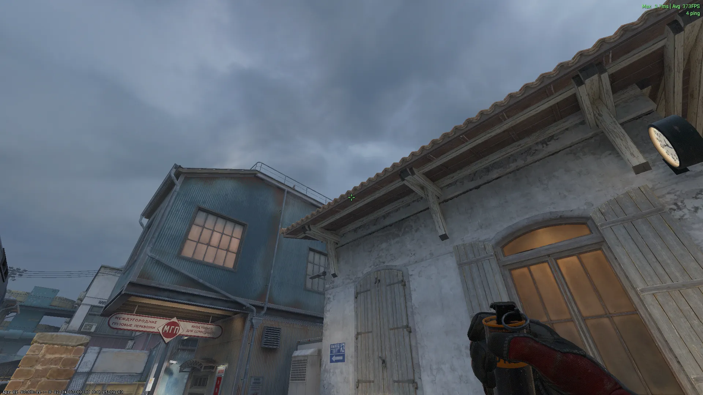
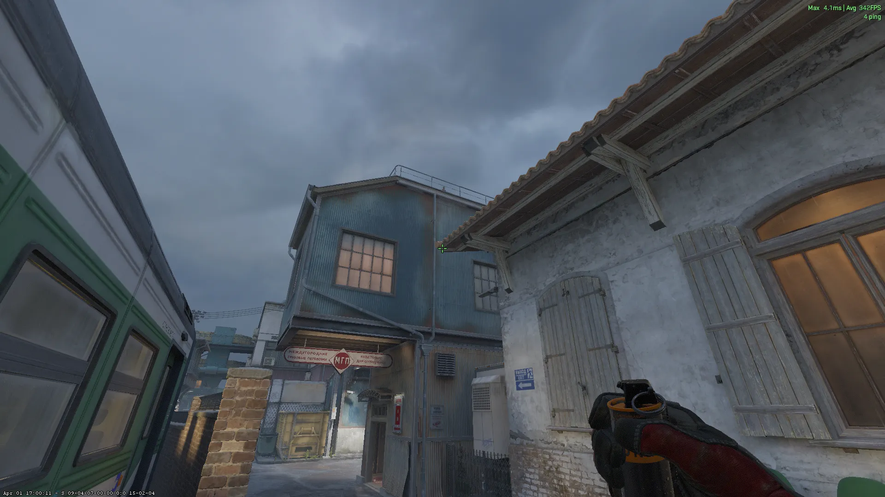
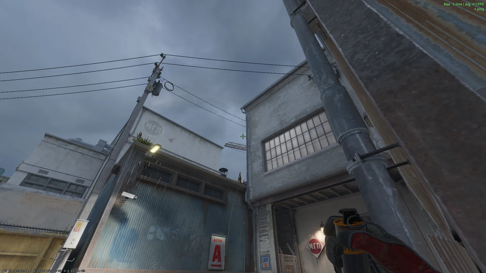
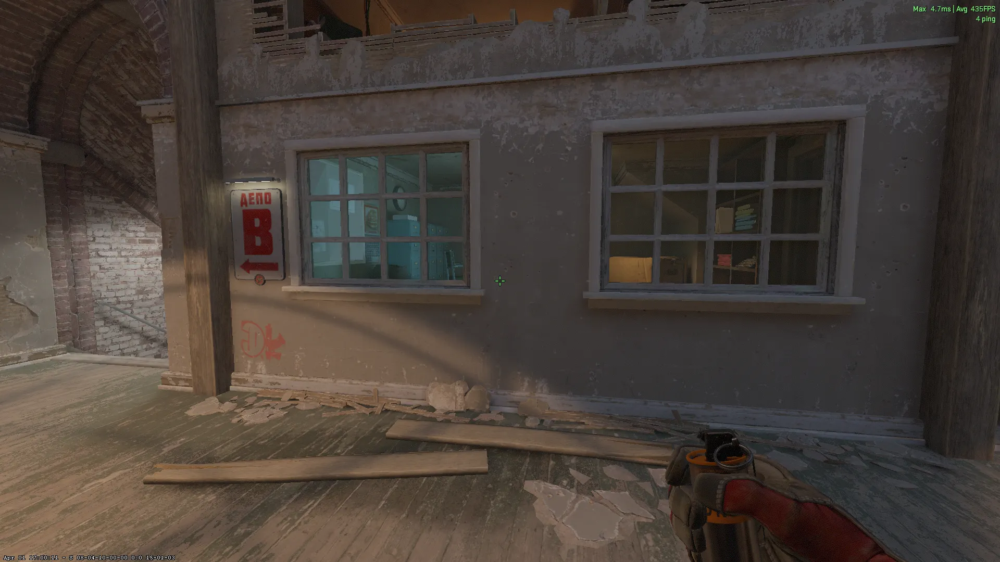
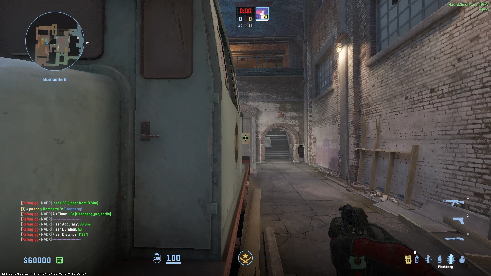

## A-Site Utility - (T-Side)

### A-Site - [Flash] - (T-Spawn)

Jumpthrow

### A-Site 2 - [Flash] - (T-Spawn)

Jumpthrow

### Connector - [Smoke] - (T-Spawn)

Jumpthrow

### Camera / Ivy - [Smoke] - (T-Spawn)

### Sandwich - [Smoke] - (T-Spawn)

## B-Site Utility (T-Side)

### Connector [Smoke] (B-Halls)

## B-Site Utility (CT-Side)

### B-Halls [Flash] - (B-Halls)

